# Integration Intelligence Platform

[](https://github.com/ThouTarnished/integration-intelligence/actions/workflows/ci.yml)

**An identity & risk-events integration for the fictional bank NovaBank.** Events stream in over REST, get
normalized and geo-enriched, are scored by an explainable rule engine, are correlated into incidents, and appear on a
live dashboard where an AI analyst explains every decision.

> All people, IPs and events are synthetic. The scoring weights are demo logic, not a security standard.

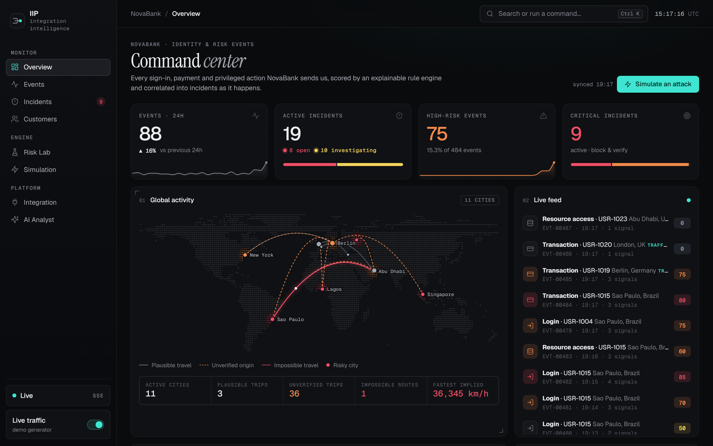

```
REST / simulator / live traffic → validate → normalize → geo-enrich → score → correlate → SQLite
                                                                       ↓
                                  dashboard ← SSE stream · batched read models · AI analyst
```

## Quick start

```bash
python -m venv .venv
source .venv/bin/activate          # Windows: .venv\Scripts\activate
pip install -r requirements-dev.txt
python -m iip                      # http://127.0.0.1:8000  ·  API docs at /docs
```

The database is created and seeded with a week of synthetic activity on first start. Run `python -m iip --reset`
before a demo for fresh, "recent" data. Turn on **Live traffic** in the sidebar to watch events stream in.

```bash
pytest                             # 94 tests
ruff check .                       # lint
docker build -t iip . && docker run -p 8000:8000 iip
```

## What's inside

| | |
|---|---|
| **Explainable risk engine** | 11 weighted signals (each mapped to MITRE ATT&CK), clamped to 0–100 → LOW / MEDIUM / HIGH / CRITICAL with a recommended action. Every score stores its per-signal contributions. |
| **Geo-velocity impossible travel** | Haversine distance ÷ elapsed time against a trusted baseline: > 900 km/h over ≥ 500 km is impossible, judged only on successful, clean-IP events. A real business trip is never flagged. |
| **Cross-account detection** | Password spray (many accounts failing from one IP), card-testing velocity, password-reset abuse. |
| **Incident correlation** | Risky events for a customer within 30 minutes merge into one incident, titled by pattern ("Card testing", "Account takeover"…). |
| **Live dashboard** | Server-Sent Events push every event to the browser: a dotted world threat map, live feed, KPI tickers, triage board, Risk Lab, simulator, integration console. |
| **AI analyst** | Understands plain questions (record IDs, customer names, attack types, cities and countries, risk levels, statuses, time windows), answers from exactly the matching records with exact counts, says so when a question has nothing to do with the platform, and can't change scores. Uses OpenAI if `OPENAI_API_KEY` is set, otherwise a deterministic analyst (works offline). |
| **Integration-grade plumbing** | Request IDs, response times, p50/p95/p99 latency, throughput, token-bucket rate limiting, constant-time API-key checks, a health endpoint with a generated endpoint catalog. |

## Screenshots

<table>
  <tr>
    <td width="50%">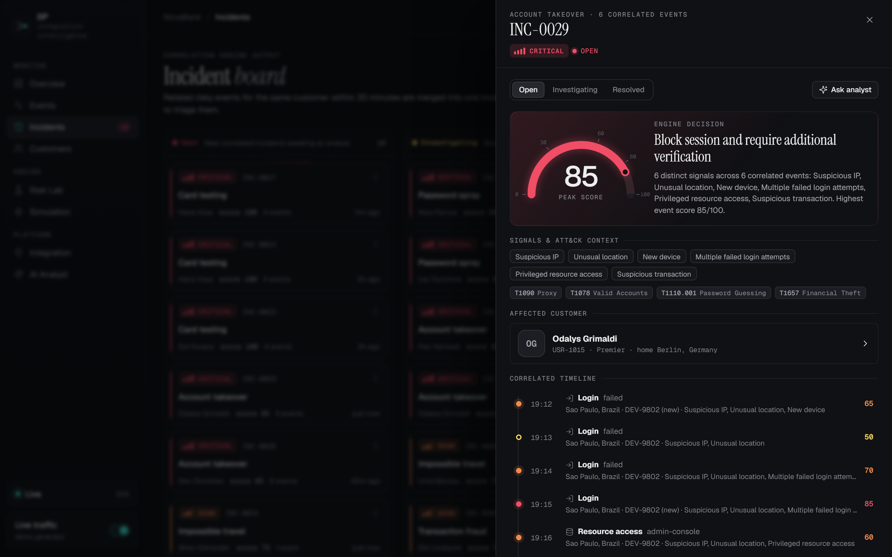<br><sub><b>Explainable incidents.</b> The engine's decision, every signal with its MITRE ATT&amp;CK technique, the affected customer and the correlated timeline.</sub></td>
    <td width="50%">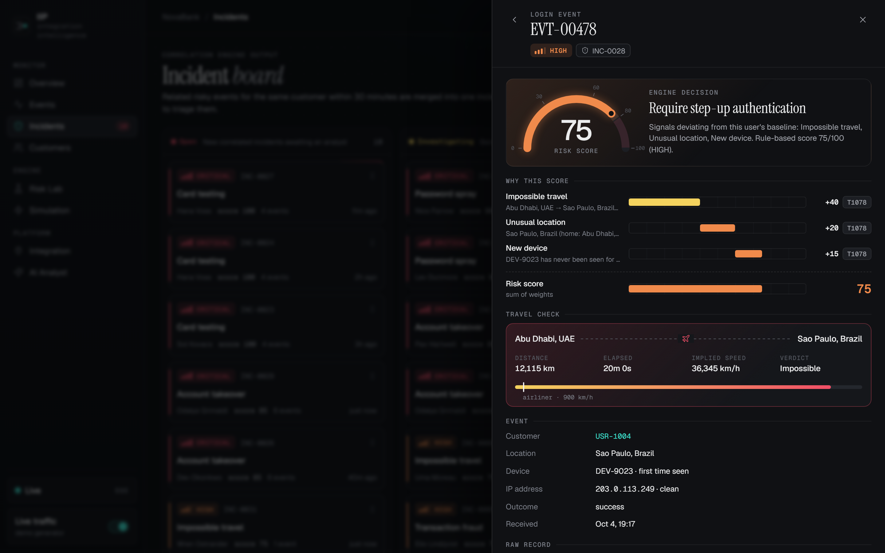<br><sub><b>Every score explained.</b> Each signal's weight and evidence, plus the geo-velocity travel check against airliner speed.</sub></td>
  </tr>
  <tr>
    <td>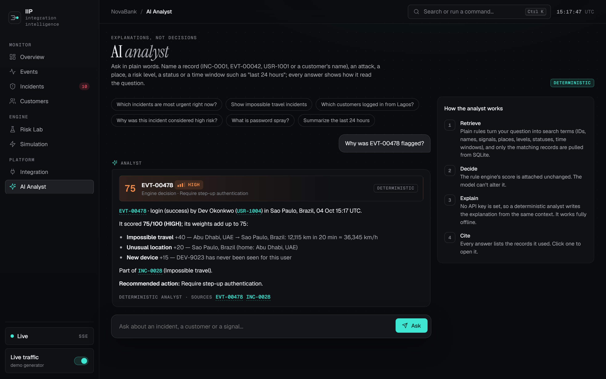<br><sub><b>AI analyst.</b> Answers from the matching records only; the rule engine's decision is shown apart, and every answer cites its sources.</sub></td>
    <td>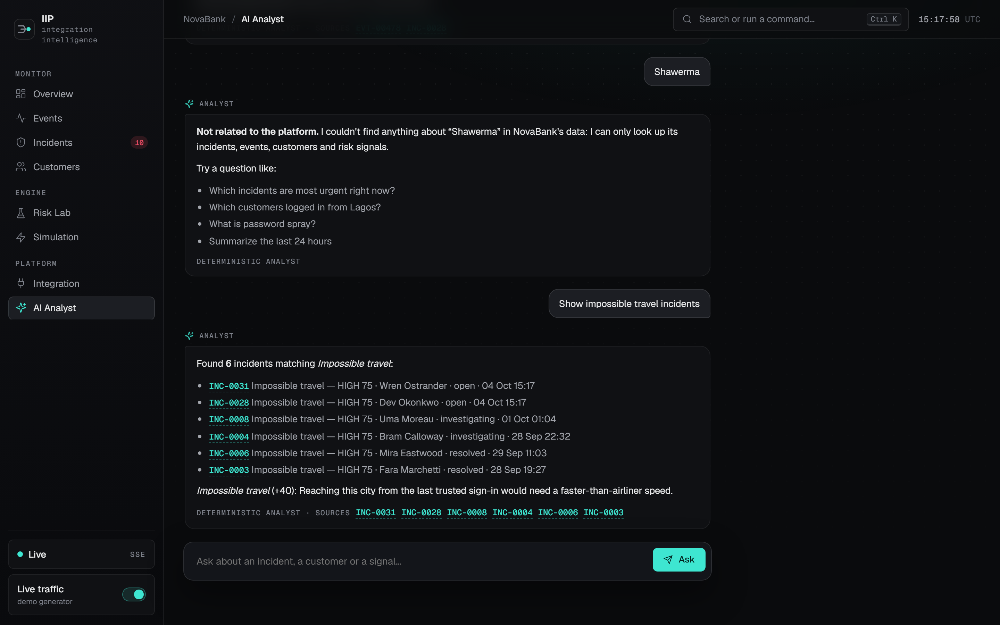<br><sub><b>Knows its scope.</b> Unrelated questions are told so; real ones read back the terms they were understood as.</sub></td>
  </tr>
  <tr>
    <td>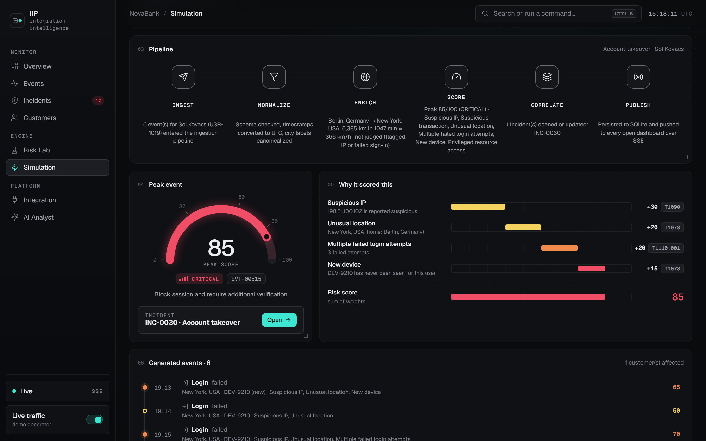<br><sub><b>Attack replay.</b> Scenarios run through the real pipeline, stage by stage, into a scored incident.</sub></td>
    <td>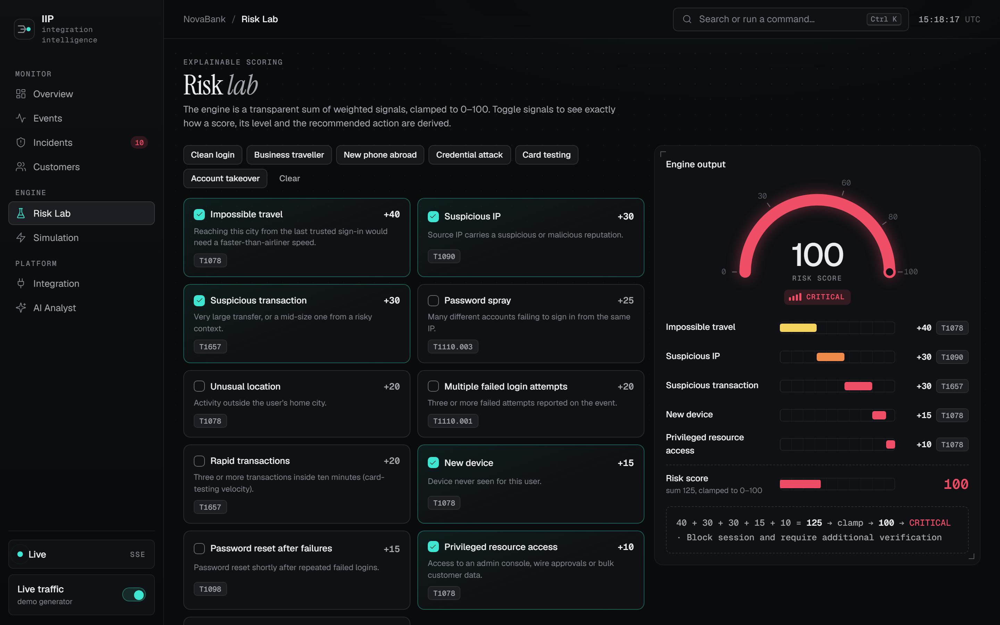<br><sub><b>Risk Lab.</b> Toggle signals and watch the score, level and recommended action follow.</sub></td>
  </tr>
  <tr>
    <td>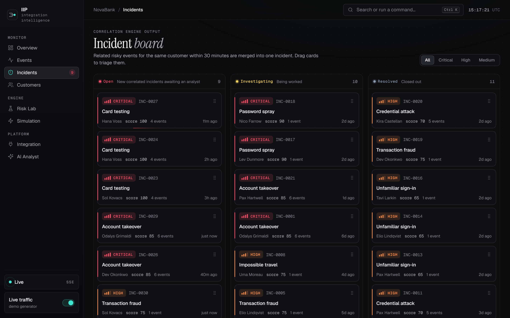<br><sub><b>Incident board.</b> Correlated incidents by status; drag a card to triage it.</sub></td>
    <td>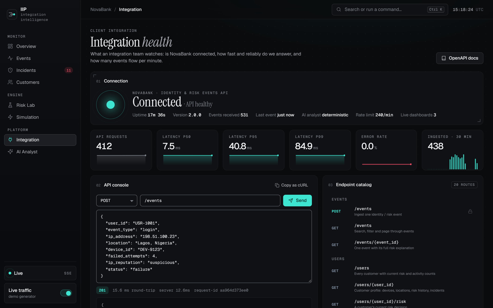<br><sub><b>Integration health.</b> Latency percentiles, error rate, an API console with request IDs, and the endpoint catalog.</sub></td>
  </tr>
</table>

## Documentation

| Document | For |
|---|---|
| [`docs/ROADMAP.html`](docs/ROADMAP.html) | **Start here to learn the codebase**: a nine-stage study path, architecture, request lifecycle, repo map, a five-minute demo script, and a glossary. |
| [`docs/CODE_WALKTHROUGH.html`](docs/CODE_WALKTHROUGH.html) | **Every line of code explained**, side by side with the source (83 files). |
| [`docs/TECHNICAL_IMPLEMENTATION.md`](docs/TECHNICAL_IMPLEMENTATION.md) | The deep technical reference: data model, algorithms, real-time design, API, frontend, testing. |
| [`docs/IMPROVEMENTS.md`](docs/IMPROVEMENTS.md) | Everything that changed from v1, and why, with research sources. |

Open the HTML docs straight from the repo in a browser. They use the vendored anime.js in `web/vendor/`, so they
work offline.

<table>
  <tr>
    <td width="50%">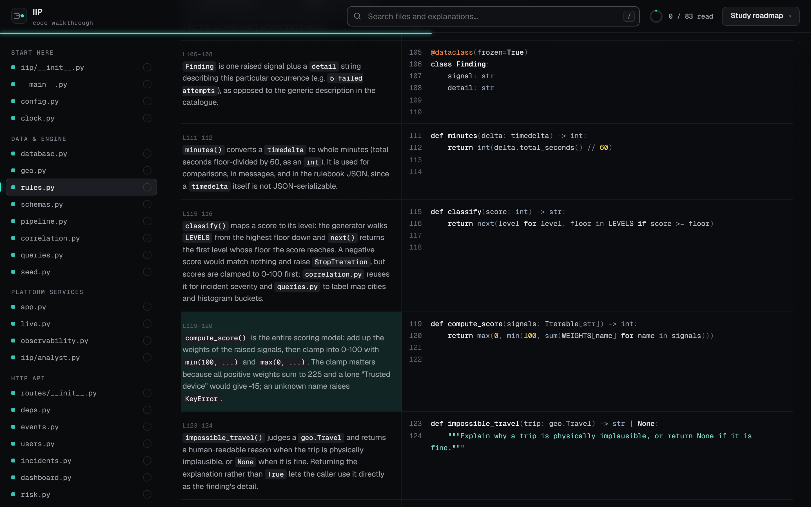<br><sub><b>Code walkthrough.</b> Every line of all 83 files explained beside the source.</sub></td>
    <td width="50%">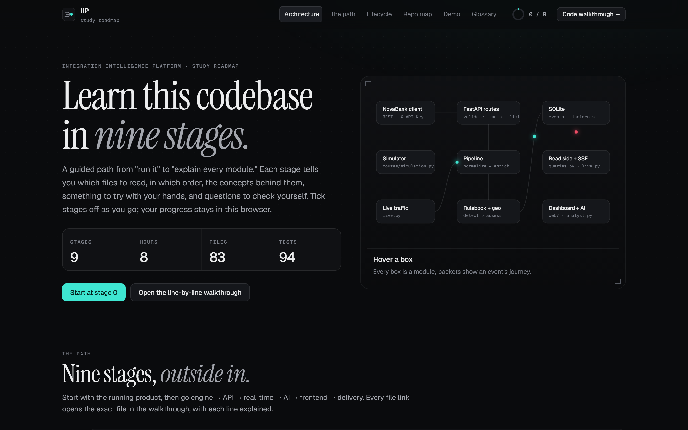<br><sub><b>Study roadmap.</b> Nine stages from "run it" to "explain every module".</sub></td>
  </tr>
</table>

## Project layout

```
iip/            FastAPI backend: config, database, geo, rules, pipeline, correlation, queries,
                live (SSE), observability, analyst, seed, routes/
web/            Dashboard: index.html, css/, js/{core,ui,charts,pages,views,data}/, vendor/anime.js
tests/          pytest suite
scripts/        build_world_dots.py (map mask) · build_walkthrough.py (docs generator + validator)
docs/           roadmap, walkthrough, technical reference, improvements, screenshots/
```

## API

Base path `/api/v1`; full interactive reference at `/docs`. Writes need the `X-API-Key` header.

```bash
curl -X POST http://127.0.0.1:8000/api/v1/events \
  -H "X-API-Key: demo-key-change-me" -H "Content-Type: application/json" \
  -d '{"user_id":"USR-1001","event_type":"login","ip_address":"198.51.100.7","location":"lagos",
       "device_id":"DEV-9001","failed_attempts":4,"ip_reputation":"suspicious","status":"failure"}'
```

`events` · `users` · `incidents` (triage via PATCH) · `dashboard/summary` · `risk/rules` · `risk/evaluate` ·
`simulation` (scenarios, live traffic, reset) · `ai/ask` · `integration/health` · `integration/metrics` · `stream` (SSE)

## Configuration

Copy `.env.example` to `.env`. The key settings are `IIP_API_KEY`, `IIP_DEMO_MODE` (set `false` to stop embedding the
key in the page), `IIP_RATE_LIMIT_PER_MINUTE`, `OPENAI_API_KEY` / `OPENAI_MODEL` / `OPENAI_BASE_URL`, and
`IIP_DB_URL`.

## Security notes

This is a demo, not production security infrastructure: one shared API key, unauthenticated read endpoints,
in-memory rate limits and metrics, and no TLS. In demo mode the dashboard page receives the API key so the browser
can call write endpoints. See [`docs/TECHNICAL_IMPLEMENTATION.md`](docs/TECHNICAL_IMPLEMENTATION.md#18-security-model).

## Credits

[anime.js](https://animejs.com) v4 (MIT) for motion · [Natural Earth](https://www.naturalearthdata.com) land data
(public domain) via [world-atlas](https://github.com/topojson/world-atlas) for the map · Geist and Instrument Serif
fonts via Google Fonts.
