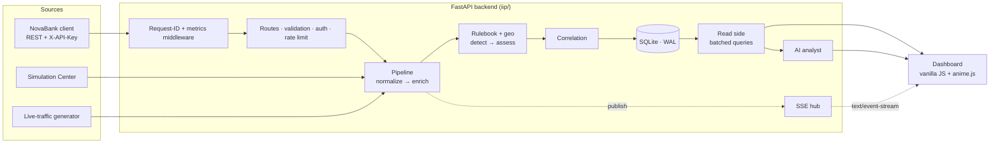
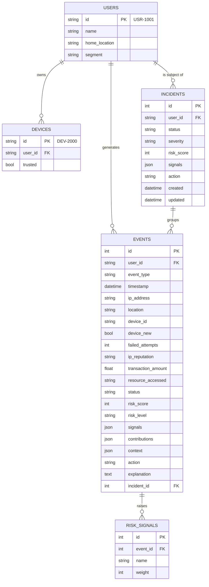
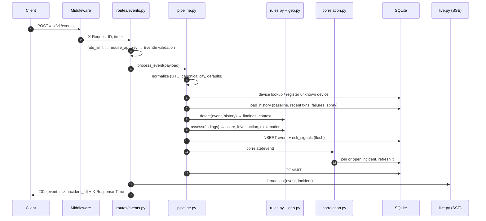

# Technical implementation

> Integration Intelligence Platform (IIP) v2.0. An identity & risk-events integration for the fictional bank
> **NovaBank**: ingestion → normalization → geo enrichment → explainable risk scoring → incident correlation →
> live dashboard → AI analyst. All data is synthetic.

This document is the deep reference. For a guided learning path open [`ROADMAP.html`](ROADMAP.html); for every line
of code explained open [`CODE_WALKTHROUGH.html`](CODE_WALKTHROUGH.html); for what changed from v1 see
[`IMPROVEMENTS.md`](IMPROVEMENTS.md).

---

## Contents

1. [System overview](#1-system-overview)
2. [Repository layout](#2-repository-layout)
3. [Configuration](#3-configuration)
4. [Data model](#4-data-model)
5. [The write path (ingestion pipeline)](#5-the-write-path)
6. [The risk engine](#6-the-risk-engine)
7. [Incident correlation](#7-incident-correlation)
8. [The read side](#8-the-read-side)
9. [Real-time layer](#9-real-time-layer)
10. [Observability and protection](#10-observability-and-protection)
11. [AI analyst](#11-ai-analyst)
12. [Synthetic data and scenarios](#12-synthetic-data-and-scenarios)
13. [HTTP API reference](#13-http-api-reference)
14. [Frontend architecture](#14-frontend-architecture)
15. [Design system and motion](#15-design-system-and-motion)
16. [Testing](#16-testing)
17. [Tooling, CI and deployment](#17-tooling-ci-and-deployment)
18. [Security model](#18-security-model)
19. [Performance notes](#19-performance-notes)
20. [Limitations and future work](#20-limitations-and-future-work)

---

## 1. System overview



**Key design decisions**

| Decision | Why |
|---|---|
| One write path (`pipeline.process_event`) for every source | REST, simulator, live traffic and the seeder are scored by exactly the same code, so demos prove production behaviour. |
| A pure rulebook (`rules.py`) with no I/O | Every rule is unit-tested without a database, and the Risk Lab's what-if endpoint runs the same functions. |
| SQLite + SQLAlchemy 2.0 | Zero setup for reviewers; any SQLAlchemy URL works via `IIP_DB_URL`. |
| Server-Sent Events instead of WebSockets | Updates only flow server → browser, SSE is plain HTTP, and `EventSource` reconnects by itself. |
| No frontend build step | `python -m iip` is the only command needed; ES modules load natively. |
| Deterministic analyst fallback | The AI feature works offline and in CI, and the model can never alter a score. |

---

## 2. Repository layout

```
integration-intelligence/
├── iip/                      backend package
│   ├── __init__.py           version
│   ├── __main__.py           CLI: python -m iip [--reset] [--reload] [--host] [--port]
│   ├── app.py                application factory, middleware, lifespan, static files
│   ├── config.py             Settings (env / .env), paths
│   ├── clock.py              utcnow(): naive UTC everywhere
│   ├── database.py           SQLAlchemy 2.0 models, engine, SQLite pragmas, session dependency
│   ├── schemas.py            Pydantic request bodies
│   ├── geo.py                city catalogue, canonical labels, haversine, travel velocity
│   ├── rules.py              signal catalogue, thresholds, detect(), assess(), what_if(), rulebook()
│   ├── pipeline.py           process_event(): normalize → enrich → score → persist → correlate
│   ├── correlation.py        incident grouping and titles
│   ├── queries.py            serializers + batched read models (dashboard, users, geo)
│   ├── live.py               SSE hub, broadcast(), live-traffic generator
│   ├── observability.py      request-ID middleware, metrics, token-bucket rate limiter
│   ├── analyst.py            AI analyst: context, decision, deterministic answers, OpenAI call
│   ├── seed.py               synthetic customers, routine activity, scenario generators
│   └── routes/               one router per domain, mounted at /api/v1
├── web/                      dashboard (served at /static, index at /)
│   ├── index.html
│   ├── css/                  tokens, base, layout, components, charts, pages
│   ├── js/
│   │   ├── main.js           router, nav, shortcuts, live toasts
│   │   ├── core/             dom, api, bus, live (SSE), motion (anime.js gateway)
│   │   ├── ui/               icons, components, drawer, toast, tooltip, palette, boot
│   │   ├── charts/           area, histogram, bars, gauge, waterfall, sparkline, riskline, worldmap
│   │   ├── pages/            overview, events, incidents, users, lab, simulation, integration, analyst
│   │   ├── views/            detail drawers (event, incident, customer)
│   │   └── data/             world-dots.js (generated land mask)
│   └── vendor/               anime.js 4.5.0 UMD build (MIT)
├── tests/                    94 pytest tests
├── scripts/                  build_world_dots.py, build_walkthrough.py
├── docs/                     ROADMAP.html, CODE_WALKTHROUGH.html, this file, IMPROVEMENTS.md, screenshots/
├── .github/workflows/ci.yml  lint + tests on Python 3.10 – 3.13
├── Dockerfile, .dockerignore
├── pyproject.toml            project metadata, pytest + ruff config
└── requirements.txt / requirements-dev.txt
```

---

## 3. Configuration

All settings are read **once** in `iip/config.py` into a frozen `Settings` dataclass. `.env` in the project root is
loaded automatically (see `.env.example`).

| Variable | Default | Purpose |
|---|---|---|
| `IIP_API_KEY` | `demo-key-change-me` | Shared secret for every write endpoint (`X-API-Key`). |
| `IIP_DEMO_MODE` | `true` | `true`: the dashboard page receives the key in a `<meta>` tag. `false`: the browser asks once per session. |
| `IIP_RATE_LIMIT_PER_MINUTE` | `240` | Token-bucket size/refill per client IP for write endpoints and `/ai/ask`. |
| `IIP_DB_URL` | `sqlite:///data/iip.db` | Any SQLAlchemy URL. The `data/` directory is created automatically for SQLite. |
| `IIP_CORS_ORIGINS` | `http://localhost:8000,http://127.0.0.1:8000` | Comma-separated origins allowed by CORS. |
| `OPENAI_API_KEY` | empty | Enables LLM explanations. Empty = deterministic analyst. |
| `OPENAI_MODEL` | `gpt-4o-mini` | Model name sent to the chat-completions API. |
| `OPENAI_BASE_URL` | `https://api.openai.com/v1` | Any OpenAI-compatible endpoint. |
| `IIP_HOST` / `PORT` | `127.0.0.1` / `8000` | Bind address for `python -m iip`. |

Tests override the environment **before** importing `iip` (`tests/conftest.py`), pointing the app at a throwaway
database in a temp directory.

---

## 4. Data model

SQLAlchemy 2.0 typed declarative models (`Mapped[...]`) in `iip/database.py`. SQLite connections enable
`PRAGMA journal_mode=WAL` (readers don't block the live-traffic writer) and `PRAGMA foreign_keys=ON`.



* **JSON columns**: `signals` (names), `contributions` (signal, weight, detail, MITRE technique) and `context`
  (enrichment such as `travel: {from, to, minutes, distance_km, speed_kmh, assessed, impossible}`) are stored as JSON,
  so the UI can render explanations without recomputing them.
* **`risk_signals`** is a deliberately narrow table (one row per raised signal) that makes "top signals" a single
  grouped query.
* **Indexes**: `events(user_id, timestamp)` composite for history lookups, plus `timestamp`, `risk_level`,
  `event_type`, `ip_address` (password-spray lookups), `incident_id`; `incidents(status)`, `incidents(updated)`.
* **Identifiers** shown to users are formatted on output: `EVT-00042`, `INC-0007` (`queries.event_ref/incident_ref`),
  and parsed back with `parse_ref`.
* **Time**: every stored timestamp is naive UTC (`clock.utcnow()`); incoming aware timestamps are converted in
  `EventIn._naive_utc`.

---

## 5. The write path

`pipeline.process_event(db, payload, commit=True)`. Every ingestion source calls this.



1. **Normalize**: default timestamp `utcnow()`, `geo.canonical()` turns `"dubai"` / `"DUBAI, uae"` into
   `"Dubai, UAE"` (a bare city name counts only when the country agrees, so `"London, Ontario"` stays an unknown
   place), trims IP, lower-cases resources, fills defaults. Before that, validation rejects timestamps before 2000
   or more than five minutes in the future, and strips whitespace before length checks.
2. **Enrich (device)**: if `device_new` wasn't supplied, it is derived from whether the device exists *and* belongs to
   this user. Unknown devices are registered (untrusted). `trusted` = owned and flagged trusted.
3. **Enrich (history)** in `load_history()`:
   * **Travel baseline**: the user's last event that was *successful and clean-IP* (trustworthy geolocation).
   * `recent_transactions`: this user's transactions in the last 10 min.
   * `recent_failures`: this user's failed events in the last hour.
   * `spray_accounts`: **other** users with failed events from the same IP in the last 30 min (`COUNT(DISTINCT user_id)`).
4. **Score**: `rules.detect()` → `rules.assess()` (pure functions, §6).
5. **Persist**: the `Event` row is flushed (so it gets an id), then one `RiskSignal` per signal.
6. **Correlate**: `correlation.correlate()` (§7).
7. **Commit** once, unless `commit=False` (the seeder commits in bulk).

---

## 6. The risk engine

`iip/rules.py` is the rulebook. **Weights are fictional demo logic, not a security standard**, but the travel and
spray thresholds follow published vendor practice (sources in [`IMPROVEMENTS.md`](IMPROVEMENTS.md#research-notes)).

### 6.1 Signals

| Signal | Weight | Fires when | MITRE ATT&CK (indicative) |
|---|---:|---|---|
| Impossible travel | +40 | Successful, clean-IP event whose implied speed from the trusted baseline is > 900 km/h over ≥ 500 km (unknown city: any move within 2 h) | T1078 Valid Accounts |
| Suspicious IP | +30 | `ip_reputation` is `suspicious` or `malicious` | T1090 Proxy |
| Suspicious transaction | +30 | Amount ≥ $10,000, or ≥ $2,000 from a new device / flagged IP | T1657 Financial Theft |
| Password spray | +25 | Failed event and ≥ 5 distinct accounts failed from this IP within 30 min | T1110.003 Password Spraying |
| Unusual location | +20 | Location ≠ home city | T1078 Valid Accounts |
| Multiple failed login attempts | +20 | `failed_attempts` ≥ 3 | T1110.001 Password Guessing |
| Rapid transactions | +20 | 3+ transactions within 10 min (this one included) | T1657 Financial Theft |
| New device | +15 | Device unseen for this user | T1078 Valid Accounts |
| Password reset after failures | +15 | `password_reset` after ≥ 3 failures in the last hour | T1098 Account Manipulation |
| Privileged resource access | +10 | `admin-console`, `wire-approval`, `customer-pii-export` | T1078 Valid Accounts |
| Trusted device | −15 | Known trusted device for this user | — |

### 6.2 Scoring

```
score  = clamp(Σ weight(signal), 0, 100)
level  = CRITICAL if score ≥ 80, HIGH if ≥ 60, MEDIUM if ≥ 30, else LOW
action = Allow | Monitor and log | Require step-up authentication | Block session and require additional verification
```

All weights are multiples of 5, so every score is one of 21 values (0, 5, …, 100). The dashboard's score histogram
uses that exact domain. `assess()` returns contributions **sorted by weight** (heaviest first, the negative last),
each with a concrete `detail` string ("Dubai, UAE → London, UK: 5,470 km in 20 min ≈ 16,412 km/h"), which the UI
renders as the waterfall.

### 6.3 Geo-velocity ("impossible travel")

`geo.haversine_km(a, b)` computes great-circle distance:

```
h = sin²(Δφ/2) + cos φ₁ · cos φ₂ · sin²(Δλ/2)
d = 2 · R · asin(√h)          R = 6371.0088 km (mean Earth radius)
speed = d / (Δt in hours)
```

Rules (from `rules.impossible_travel` and `rules.detect`):

* The comparison point is the user's last **successful, clean-IP** event, because proxies and VPN exits make
  geolocation unreliable (the approach used by Panther and Microsoft Defender).
* Travel is **computed for every move** (it feeds the map) but only **judged** when the current event is successful
  and clean-IP; otherwise `context.travel.assessed = false` and the IP signal carries the risk.
* Hops under **500 km** are never impossible (geo-IP noise; Datadog / Elastic use the same floor).
* Over that, speeds above **900 km/h** (airliner cruise; Panther's threshold) are impossible.
* Unknown cities fall back to the v1 heuristic (any move within two hours).

The v1 rule ("different city within 2 hours") flagged Abu Dhabi → Dubai (~120 km) as impossible; v2 doesn't.

### 6.4 What-if analysis

`rules.what_if(names)` scores an arbitrary signal set; `POST /api/v1/risk/evaluate` exposes it for the Risk Lab, and
`GET /api/v1/risk/rules` returns the entire rulebook (signals, levels, thresholds) so the UI never hard-codes them.

---

## 7. Incident correlation

`iip/correlation.py`, constants in `rules.py`:

| Constant | Value | Meaning |
|---|---:|---|
| `CORRELATION_WINDOW` | 30 min | How far around an event an open incident stays "joinable", and how far back preceding events are pulled in. Both windows are bounded on both sides, so a backfilled event never joins or pulls in later activity. |
| `INCIDENT_JOIN_SCORE` | 30 | An event at least this risky joins the user's open incident. |
| `INCIDENT_OPEN_SCORE` | 60 | An event at least this risky opens a new incident. |
| `INCIDENT_PULL_SCORE` | 20 | On opening, the user's preceding events in the window that scored ≥ 20 *or failed* are pulled in. |

After any change `refresh_incident()` recomputes the incident's score (peak event), severity, distinct positive
signals (first-seen order), action and `updated`. `incident_title()` names the pattern from its signals using an
ordered rule list: Account takeover, Password spray, Account recovery abuse, Card testing, Impossible travel,
Transaction fraud, Credential attack, Unfamiliar sign-in, Anomalous activity.

Incident lifecycle: `OPEN → INVESTIGATING → RESOLVED` via `PATCH /api/v1/incidents/{id}` (the board's drag-and-drop
and the drawer's segmented control both call it). Resolved incidents are never joined again.

---

## 8. The read side

`iip/queries.py` keeps response time flat as data grows by **batching** instead of issuing queries per row:

* `incidents_page()`: serializes any incident query with two extra grouped lookups (names, event counts).
* `users_overview()`: five queries total for any number of users. The "current risk" (highest score among each
  user's 10 most recent events) uses a window function:

  ```sql
  SELECT * FROM (
    SELECT user_id, risk_score, risk_level, timestamp,
           row_number() OVER (PARTITION BY user_id ORDER BY timestamp DESC, id DESC) AS rank
    FROM events) WHERE rank <= 10;
  ```
* `dashboard_summary()`: KPIs (24 h vs previous 24 h), 24 hourly buckets (total + high/critical), 7 daily buckets
  per level, score histogram, severity/status distributions, top signals with MITRE, recent incidents/events,
  riskiest users and `geo_overview()` (cities with coordinates and peak risk, recent city-to-city trips for arcs).
  Daily buckets are counted in SQL (`date()` plus `GROUP BY`, at most 28 rows whatever the volume); the hourly
  buckets are rolling windows, so only the last 24 hours are loaded into Python.

---

## 9. Real-time layer

### 9.1 SSE hub (`iip/live.py`)

* `GET /api/v1/stream` returns `text/event-stream`. Each client gets an `asyncio.Queue` (max 256).
* Message format: `id: <n>\nevent: <kind>\ndata: <json>\n\n`; the first chunk sends `retry: 3000` so browsers
  reconnect after 3 s; a `: keep-alive` comment is sent every 15 s of silence.
* Kinds: `event` (`{source, event}`), `incident` (incident summary), `traffic` (generator status), `reset`.
* **Threading**: FastAPI runs sync endpoints in a thread pool, but queues belong to the event loop. `publish()`
  therefore uses `loop.call_soon_threadsafe(...)`; the loop is bound in the app lifespan.
* **Back-pressure**: if a slow client's queue is full, its oldest message is dropped instead of blocking everyone.
* When a client disconnects, Starlette stops the streaming response and closes the generator; its `finally` block
  removes the client's queue, so `hub.clients` stays accurate.

### 9.2 Live-traffic generator

An `asyncio.Task` that every 1.0–2.8 s runs `_tick` **in the thread pool** (`run_in_threadpool`, since DB access is
synchronous): 94% routine activity for a random customer (home city, trusted device), 6% a random attack scenario
via `seed.plan_scenario` (a password spray picks extra victims). It suppresses routine transactions for a user
within the rapid-transaction window, so a time-compressed demo doesn't produce false "Rapid transactions" flags.
Toggled by `POST /api/v1/simulation/traffic`, stopped on shutdown and before a reset. `stop()` also waits for a tick
still running in its worker thread (threads can't be cancelled), so a reset never races it.

---

## 10. Observability and protection

`iip/observability.py`:

* **`RequestContextMiddleware`** (pure ASGI, so the SSE stream passes straight through): reuses an incoming
  `X-Request-ID` when it is a safe token (letters, digits, `._-`, at most 64 characters) or generates one, adds
  `X-Request-ID` and `X-Response-Time` to every response, logs one line per API call and records metrics. Metrics
  are keyed by the matched route template (`/users/{user_id}`); paths that match no route share one `(unmatched)`
  entry.
* **`Metrics`** (thread-safe): request count, error count, status classes, per-route count/errors/average latency,
  the last 2,000 latencies for p50/p95/p99, and ingested events per minute for the last 30 minutes.
  `GET /api/v1/integration/metrics` exposes a snapshot.
* **`RateLimiter`**: token bucket per client IP, capacity and refill = `IIP_RATE_LIMIT_PER_MINUTE`. Applied before
  authentication (so key guessing is throttled too); exceeding it returns **429** with `Retry-After`. Idle buckets
  are pruned once more than 10,000 clients have been seen.
* **Health**: `GET /api/v1/integration/health` checks the database (`select 1`) and reports status, version, uptime,
  AI mode, live clients, traffic status and an **endpoint catalog generated from the OpenAPI schema** (auth detected
  from the `x-api-key` header parameter).

---

## 11. AI analyst

`iip/analyst.py`. **The engine decides; the analyst explains.**

1. `parse_question()` reads the question with plain rules (no model) into a `Question`: record IDs in any common form
   (`INC-12`, `incident 12`, `EVT-00520`, `customer 1004`), a customer by full name, surname or first name (short
   first names such as "Dev" only when capitalized), signals and attack patterns ("impossible travel", "card
   testing", "account takeover"), cities and countries ("Russia" → Moscow, via `geo.COUNTRY_ALIASES`), risk levels,
   incident statuses, event types, failed or successful outcomes, a time window ("today", "last 24 hours", "6h") and
   the intent: focus on a record, the most urgent incident, the scoring model, a definition, a count, a summary, a
   search, small talk, or a question about something else. Matched phrases are blanked out as they are used, so no
   words are read twice.

   **Off-topic questions.** A question with no record ID, customer, signal, pattern, event type or platform word
   (`ON_TOPIC`: risk, fraud, attack, incident, customer, account…) may still be made only of common words
   (`COMMON_WORDS`, about 500) and search terms ("What's urgent in Lagos?"). One word outside both ("Shawerma",
   the "weather" in "What's the weather in Dubai?") makes it `unrelated`: nothing is retrieved, the model is not
   called, and the reply says the question isn't related to the platform and suggests what to ask. Greetings and
   thanks (`SMALL_TALK`) get a short reply instead. Words in a non-Latin script, which normalization would drop,
   count as unknown, so Arabic text is caught too.
2. `gather_context()` retrieves only what matches: a focused incident, event or customer in full; otherwise SQL
   searches over incidents, events or customers (signals through the indexed `risk_signals` table) with exact totals
   and breakdowns, definitions that quote the rulebook's own thresholds, the scoring model, or an overview of the
   window. An empty search also runs one looser search (without the time window, else without the place). Unknown IDs
   are reported in `not_found`.
3. `engine_decision(ctx)`: the deterministic verdict for a focused record (subject, score, level, signals, action),
   shown separately in the UI.
4. With `OPENAI_API_KEY`: POST to `{OPENAI_BASE_URL}/chat/completions` (temperature 0.2, 20 s timeout) with a system
   prompt restricting the model to the JSON context (which includes the interpretation), telling it to say so when a
   question is about something else, forbidding score changes and asking for concise markdown. Context is truncated
   to 14,000 characters.
5. Without a key, or on any HTTP/parse error: `deterministic_answer()` composes markdown from the same context, and
   every answer reads back the terms it understood (*Impossible travel · Lagos · last 24 hours*). A `note` explains a
   fallback.
6. `sources` lists every record the answer shows; the UI renders them as clickable references.

On a probe of 20 realistic questions the old keyword matcher answered 2 correctly; the parser answers all 20, and the
counts it quotes match direct SQL counts (pinned by `tests/test_analyst.py`). A second probe of 176 questions (44
unrelated, 30 small talk, 102 about the platform) is classified without a single miss.

---

## 12. Synthetic data and scenarios

`iip/seed.py`: 25 fictional customers (homes: Abu Dhabi, Dubai, London, Berlin), two trusted devices each, and a
reproducible week (`random.Random(42)`):

1. 10–18 routine events per customer at home on trusted devices.
2. Four legitimate **business trips** (plausible travel that must *not* be flagged); conflicting routine events
   inside the trip window are removed.
3. Historical attacks across the week, plus one password spray.
4. Three fresh attacks in the last two hours so the dashboard opens on active incidents.
5. Incidents older than 24 h are marked resolved/investigating.

All IPs are RFC 5737 documentation ranges (`203.0.113.0/24` clean, `198.51.100.0/24` flagged).

| Scenario | Category | Events |
|---|---|---|
| `normal_login` | baseline | 1 home login on a trusted device |
| `business_trip` | benign | home login, then two events in another city 8 h later |
| `new_device` | suspicious | sign-in from an unknown device in a foreign city |
| `brute_force` | attack | 5 failed logins, flagged IP, new device |
| `impossible_travel` | attack | home login, then a foreign sign-in 20 min later |
| `suspicious_transaction` | fraud | $12,500 from a new device on a flagged IP |
| `card_testing` | fraud | 3 tiny probes in ~3 min, then a $2,450 cash-out |
| `password_reset_abuse` | attack | 3 failures, password reset, attacker sign-in |
| `password_spray` | attack | 1 IP, 1 failed guess on each of 6 accounts |
| `account_takeover` | attack | failures → foreign sign-in → admin console → $15,000 transfer |

Simulations are shifted so their last event happens **now** (`ending_at`). Benign scenarios pick a customer whose
last trusted sign-in was at home and who has been quiet for the scenario's duration, so a real recent login can't
contradict the replay. If nobody has been quiet that long (live traffic reaches every customer within minutes),
the business trip returns **409** with the reason rather than replay a trip the engine would rightly flag.
`?user_id=` targets a specific customer.

---

## 13. HTTP API reference

Base path `/api/v1`. Interactive docs at `/docs` (Swagger UI) and `/openapi.json`. 🔒 = requires `X-API-Key`
(and is rate-limited).

| Method | Path | Description |
|---|---|---|
| POST 🔒 | `/events` | Ingest one event → `{event, risk, incident_id}` (201) |
| GET | `/events` | Search & filter: `q, event_type, risk_level, user_id, sort, limit, offset` |
| GET | `/events/{event_id}` | One event with contributions and travel context |
| GET | `/users` | Every customer with current risk and counts |
| GET | `/users/{user_id}` | Profile: devices, locations, risk history, incidents, timeline |
| GET | `/users/{user_id}/risk` | Current risk decision |
| GET | `/incidents` | Incidents (`status`, `limit`), most recent first |
| GET | `/incidents/{incident_id}` | Incident with timeline, customer and ATT&CK techniques |
| PATCH 🔒 | `/incidents/{incident_id}` | `{status: OPEN \| INVESTIGATING \| RESOLVED}` |
| GET | `/dashboard/summary` | Everything the Overview page needs |
| GET | `/risk/rules` | The rulebook |
| POST | `/risk/evaluate` | `{signals: [...]}` → what-if assessment (nothing stored) |
| GET | `/simulation` | Scenario catalogue |
| GET | `/simulation/traffic` | Generator status |
| POST 🔒 | `/simulation/traffic` | `{enabled: bool}` |
| POST 🔒 | `/simulation/reset` | Wipe and re-seed |
| POST 🔒 | `/simulation/{scenario}` | Run a scenario (`?user_id=` optional) → steps, events, top event, incident |
| POST | `/ai/ask` | `{question}` → decision, explanation, sources, source, note (rate-limited) |
| GET | `/integration/health` | Status, versions, uptime, AI mode, endpoint catalog |
| GET | `/integration/metrics` | Requests, errors, latency percentiles, throughput, routes |
| GET | `/stream` | Server-Sent Events |

Errors use FastAPI's `{"detail": ...}` shape: 401 bad key, 404 unknown record/scenario/user, 409 no data,
422 validation, 429 rate limit, 500 unexpected (logged, generic body).

---

## 14. Frontend architecture

No framework and no bundler: native ES modules served from `web/` (at `/static`, with `Cache-Control: no-cache`
so browsers revalidate unfingerprinted files instead of running a stale copy after an update).

```
main.js ─┬─ core/api.js     fetch wrapper (adds X-API-Key to writes; reports status/latency/request-id)
         ├─ core/live.js    EventSource → bus ("live:event", …); reconnects if the browser gives up, "live:resync"
         ├─ core/bus.js     tiny pub/sub on EventTarget
         ├─ core/dom.js     html`` auto-escaping template, raw(), formatters
         ├─ core/motion.js  the only module touching anime.js
         ├─ pages/*.js      { title, render(view, ctx, params) }
         ├─ views/details.js  event / incident / customer drawers
         ├─ ui/*.js         components, drawer, palette, toast, tooltip, boot, icons
         └─ charts/*.js     hand-built SVG/canvas charts
```

* **Safety by default**: `html` is a tagged template that HTML-escapes every interpolated value unless it is itself
  `html`/`raw` output. API data can't inject markup. The mini-markdown renderer escapes first, then allows only
  bold, code, bullets and clickable `INC-/EVT-/USR-` references.
* **Routing**: hash routes (`#/events?q=lagos`). Each render receives a context whose `on()`, `every()` and `add()`
  registrations are torn down on navigation, and a **fresh outlet element** (`#view` is cloned without listeners
  and swapped in), so no listener a page attached can outlive it. A navigation token discards a slow render if the
  user has already moved on, and a context knows when its page is gone: listeners or timers a slow page registers
  after the user left are torn down at once. Pages exit (150 ms fade) and enter (staggered blur-fade).
* **Live data**: pages subscribe through `ctx.on("live:event", …)`. The Overview prepends to its feed with FLIP,
  pings the map and bumps counters; Events shows a "N new events · show" pill instead of moving rows under the
  reader; the Incidents board upserts cards with a keyed FLIP; global toasts announce new HIGH/CRITICAL incidents
  (throttled, suppressed on the Simulation page). After a reconnect, `live:resync` makes pages refetch, and the
  Incidents badge is recounted from the API rather than bumped on every incident message.
* **Stale responses**: the Events table and the Risk Lab number their requests, so a slow, overtaken response is
  dropped instead of overwriting newer results. The shared chart tooltip hides on navigation, scroll, clicks and key
  presses, so it never lingers over a page that is gone.
* **Detail drawers** keep a history stack (incident → event → back). The frame mounts once per opening so the
  slide-in animation is never cut short by fast responses. A close still animating can't wipe a drawer reopened
  meanwhile, a slow view that failed can't overwrite a newer one, each view may return a teardown from `after()`,
  and Tab stays inside the sheet, as it does in the palette.
* **Command palette** (`Ctrl/⌘+K`): pages, actions (traffic, motion, docs), scenarios, open incidents and
  customers, with subsequence fuzzy matching and keyboard navigation. It also hosts the API-key prompt when demo
  mode is off.
* **Keyboard**: `g` then `o/e/i/c/l/s/n/a` to navigate, `/` focuses the Events search, `Esc` closes overlays.
  Shortcuts pause while a drawer is open, and Enter or Space opens a focused timeline row.

### Charts (`web/js/charts/`)

| Module | Technique |
|---|---|
| `core.js` | nice axis maxima, linear scales, **Fritsch–Carlson monotone cubic** paths (smooth without overshoot), resize handling, edge-fading grid mask, CSS-variable resolution for SVG attributes |
| `area.js` | neutral total volume + high/critical share in risk colour, clip-path reveal (1.1 s, `cubic-bezier(.85,0,.15,1)`), snapping crosshair and tooltip |
| `histogram.js` | 21 bars (every possible score), **√ scale** so the long tail stays visible, threshold markers at 30/60/80 |
| `gauge.js` | semicircle via polar → cartesian maths; one animated value drives the arc, riding knob, number **and** colour, so the arc visibly crosses levels |
| `waterfall.js` | running totals per signal, negative contributions hatched, clamping called out, sequenced anime timeline |
| `worldmap.js` | 3,791 land dots decoded from a 3.6 KB bit mask and drawn to a DPR-scaled canvas in one `Path2D`, risk "heat" tint around hot cities, left-to-right scan reveal, SVG quadratic arcs (plausible / unverified origin, i.e. a flagged IP or failed sign-in / impossible), comets riding impossible routes via `svg.createMotionPath`, live pings, label collision avoidance |
| `sparkline.js`, `riskline.js`, `bars.js` | small trends, the customer risk line over level bands, horizontal bar lists |

The land mask comes from `scripts/build_world_dots.py`: Natural Earth 1:110m land (TopoJSON, quantized + delta
encoded) → decoded arcs → rings → even-odd point-in-polygon on a 2° equirectangular grid (180 × 70) → one hex string
per row.

---

## 15. Design system and motion

**Tokens** (`web/css/tokens.css`): near-black neutral surfaces (`#0a0b0d` → `#24272d`), decorative hairlines at
6.5–11% white, 3:1-contrast control borders (`#474b54`), text ramp `#ecedee → #565a62`, one **aqua accent**
(`#3ee6d1`) for interactivity and "live", and a **risk ramp used for nothing else**: LOW `#8a9bb0` (slate: nothing
to see), MEDIUM `#f4d35e`, HIGH `#f08a4b`, CRITICAL `#f04e66`. Severity badges always pair colour with a 4-pip
signal bar and text, so they never rely on colour alone. Type: **Geist** (UI), **Geist Mono** (data, IDs,
labels), **Instrument Serif** (page titles).

**Motion rules** (`web/js/core/motion.js`, anime.js v4.5.0):

1. **Content is never hidden by CSS waiting for JS.** Animations start from values JS sets, so if anime.js fails to
   load the UI is simply static.
2. **`motionEnabled()`** is false when the OS asks for reduced motion, when the in-app toggle (palette → "Reduce
   motion", persisted) is off, or when the tab is hidden. anime.js pauses its engine in hidden documents, which
   would otherwise freeze freshly rendered content at its invisible start state. Disabled motion runs every
   animation with `duration: 0`, so final states are always reached.
3. **Entrances clean up explicitly.** When `enter()` finishes it removes exactly the inline `opacity`, `transform`
   and `filter` it set. anime's `cleanInlineStyles()` is avoided because it restores whatever inline values
   existed when the animation was created; if another animation had already set its starting values on the
   same element in the same tick, that "cleanup" would leave the element invisible.
4. **Tokens**: entrances use `outExpo` (≈ `cubic-bezier(.16,1,.3,1)`), springs for indicators
   (`spring({bounce: .1–.2})`), chart reveals 1.1 s. Staggers are capped (first 10–16 items) so long lists don't
   wait on animation.
5. **At most one ambient animation per view**: the map's comets / city pulses on Overview, the border beam on the
   single most urgent incident card, the live dot.

Signature moments: boot sequence (once per session, real numbers, skippable); spotlight borders that follow the
cursor across a panel grid; KPI count-ups; map scan reveal; the six-stage simulation pipeline with a travelling
packet and typed step details; the Risk Lab gauge animating from the previous score; keyed-FLIP triage board.

---

## 16. Testing

`pytest` (94 tests, ~8 s) in `tests/`:

| File | Covers |
|---|---|
| `test_rules.py` | additive/clamped scoring, level boundaries, every signal, geo-velocity cases (short hop, plausible flight, unknown city, unreliable events not judged), transactions, spray, ordering of contributions, what-if, rulebook, MITRE URLs |
| `test_geo_and_correlation.py` | canonical labels and their country check, haversine against a known distance, travel maths, incident titles |
| `test_api.py` | seeding, auth, validation (422/404), ingestion + normalization + headers, search/filter/sort, users, triage, dashboard shape, risk endpoints, health catalog, metrics, the page and docs; out-of-range timestamps, blank locations and malformed IDs |
| `test_simulation.py` | every scenario's 6 stages, no-incident baseline, plausible business trip, brute-force correlation, impossible travel speed, multi-account spray, guards, traffic toggle, reset |
| `test_analyst.py` | the question parser (IDs, names, places, windows, statuses), searches whose results really match, counts that equal direct SQL counts, event explanations, definitions quoting the real thresholds, honest empty results, focusing by ID and surname, missing records, validation, **OpenAI failure fallback**, signal breakdowns that add up to the score, and off-topic questions and small talk (no records, no model call) |
| `test_live_and_observability.py` | SSE hub fan-out and cleanup, publish without subscribers, token bucket, percentile maths, unsafe request IDs and unknown-path metrics |

Isolation: `conftest.py` sets `IIP_DB_URL` to a temp directory, a known API key, a huge rate limit, demo mode and an
*empty* `OPENAI_API_KEY` (so a developer's `.env` can't switch the suite to the paid API) before importing the app; detection tests that need a known history reset the database and target a specific customer.

---

## 17. Tooling, CI and deployment

* **Run**: `python -m iip` (`--reset` re-seeds; `--reload` for development).
* **Lint**: `ruff check .` (pyflakes, pycodestyle, isort, bugbear, pyupgrade, simplify; line length 120).
* **CI**: `.github/workflows/ci.yml` installs `requirements-dev.txt`, runs ruff and pytest on Python 3.10, 3.11, 3.12
  and 3.13.
* **Docker**: `docker build -t iip . && docker run -p 8000:8000 iip`. Slim Python 3.12 image, binds `0.0.0.0`,
  includes a `HEALTHCHECK` against `/api/v1/integration/health`.
* **Docs generation**: `python scripts/build_walkthrough.py` validates that every non-blank line of 83 files is
  explained (and that no annotation is stale), then renders `docs/CODE_WALKTHROUGH.html` (7,822 lines, 3,882
  explanations).

---

## 18. Security model

This is a **demo**, not production security infrastructure. What it does:

* Shared-secret API key on all writes, compared with `secrets.compare_digest` (constant time).
* Token-bucket rate limiting on writes and the AI endpoint, applied before auth.
* Strict Pydantic validation (patterns, enums, ranges, IP parsing, timestamps between 2000 and five minutes ahead)
  on all input.
* Output escaping by default in the frontend; no inline event handlers.
* Generic 500 bodies; details only in server logs, correlated by request ID.
* `IIP_DEMO_MODE=false` stops the key being embedded in the dashboard page.
* The AI analyst receives only database-derived context, never raw user input beyond the question, and cannot
  change decisions.

What it doesn't do (by design, for a demo): per-client keys or OAuth, TLS termination, authenticated reads,
persistent rate-limit state across processes, audit logging.

---

## 19. Performance notes

* Write path: ~4 indexed queries per event plus inserts; local ingestion is typically 5–30 ms.
* Read side: constant query count per endpoint regardless of user/incident count (batched + window functions).
* SQLite WAL lets the live generator write while dashboards read.
* SSE fan-out is O(clients) per message and runs on the event loop; slow clients drop their own oldest messages.
* Frontend: the map draws ~3.8k dots in a single `Path2D` fill; charts redraw only when their width changes;
  hidden tabs skip animation entirely.

---

## 20. Limitations and future work

* Locations are labels resolved against a 21-city catalogue; a real system would use a geo-IP database (with
  accuracy radii) and ASN/VPN intelligence.
* Rules are static code; next steps would be YAML-configurable rules (Sigma-style correlation), per-customer
  baselines (known cities/devices learned over 30 days), and score decay over time.
* Diminishing-returns aggregation (as in Elastic entity risk scoring) instead of a hard clamp would separate
  "many weak signals" from "a few strong ones".
* Webhook/queue delivery of incidents (e.g. to a SIEM), per-client API keys, Alembic migrations, PostgreSQL.
* Persist metrics to Prometheus/OpenTelemetry instead of process memory.
